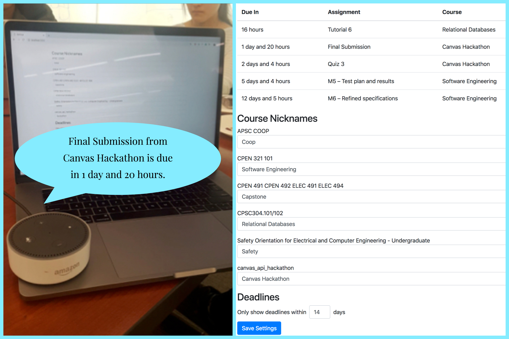
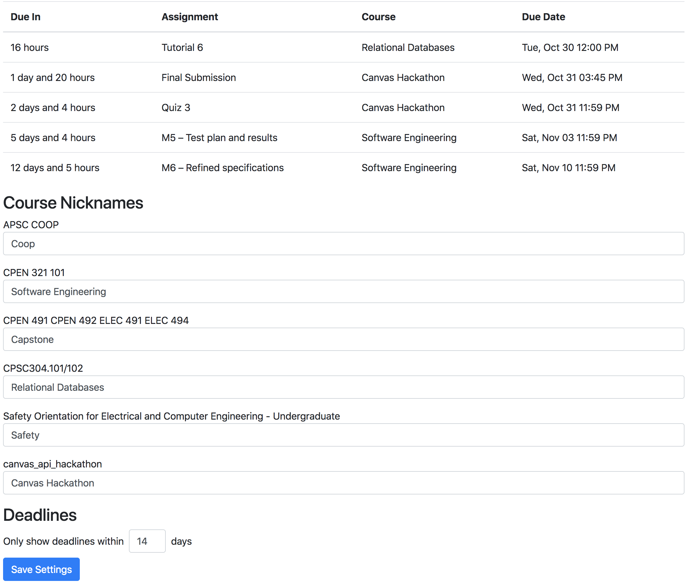

# Voice Activated Assignment Deadlines

An Alexa skill to tell you your assignment deadlines, just say "open assignment deadlines".



There is also a web application that can display the deadlines and configure the Alexa skill. For example, you can
- Add a nickname for your obscure course names: e.g. "Relational Databases" for "CPSC 304 101/102".
- Limit the timeline of due dates to annouce: e.g. "within 3 days" or "within 20 days".

Won 2nd place for the UBC Canvas API 2018 hackathon, [here](/slides/Voice-Activation-Deadline-Hackathon-Presentation.pptx) are the presentation slides.

## Demo
Sample of how Alexa speaks in SSML (Speech Synthesis Markup Language):
```xml
<speak>
    <p>Final Submission from Canvas Hackathon is due in 1 day and 20 hours.</p>
    <p>Quiz 3 from Canvas Hackathon is due in 2 days and 4 hours.</p>
    <p>M5 - Test plan and results from Software Engineering is due in 5 days and 4 hours.</p>
    <p>M6 - Refined specifications from Software Engineering is due in 12 days and 5 hours.</p>
</speak>
```

Web Application to configure settings:

